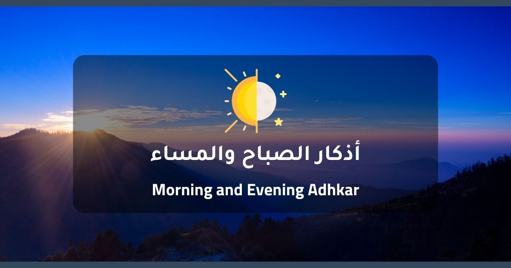

<div align=center>
       <a href="/README_AR.md">
        
       </a>
</div>

<h1 align=center> 📚 Morning & Evening Adhkar </h1>
<p align=center><strong>Morning and Evening Adhkar PWA</strong></p>

<div align=center>
    <!-- Replace with actual project screenshot if available -->
    
</div>

<p align=center><strong>
Adhkar is a Progressive Web Application (PWA) built with Next.js that provides a digital interface for reading Morning and Evening Adhkar. It is designed to be fast, offline-capable, and user-friendly, helping Muslims maintain their daily remembrance of Allah.
</strong></p><br>

✨ Only by the remembrance of Allah do hearts find rest.

## 🚀 Getting Started

### Prerequisites

- Node.js (v18 or higher)
- npm, yarn, pnpm, or bun

### Installation

1. Clone the repository:

   ```bash
   git clone https://github.com/AbdelrahmanBayoumi/morning-evening-adhkar.git
   cd morning-evening-adhkar
   ```

2. Install dependencies:

   ```bash
   npm install
   # or
   yarn install
   ```

3. Run the development server:

   ```bash
   npm run dev
   # or
   yarn dev
   ```

4. Open [http://localhost:3000](http://localhost:3000) with your browser to see the result.

## 📱 Features

- **PWA Support**: Installable on mobile and desktop devices.
- **Offline Mode**: Access Adhkar even without an internet connection.
- **Dual Language**: Support for Arabic and English interfaces.
- **Dark/Light Mode**: Comfortable reading experience at any time.
- **Audio Playback**: Listen to the correct pronunciation of Adhkar.
- **Progress Tracking**: Mark Adhkar as read and track your daily progress.

## 🛠️ Built With

- [Next.js](https://nextjs.org/) - The React Framework for the Web
- [TypeScript](https://www.typescriptlang.org/) - Typed JavaScript
- [Tailwind CSS](https://tailwindcss.com/) - Utility-first CSS framework
- [Radix UI](https://www.radix-ui.com/) - Unstyled, accessible components

## 📚 Data Source

The Adhkar data is sourced from the [Morning and Evening Adhkar Database](https://github.com/Seen-Arabic/Morning-And-Evening-Adhkar-DB) by **Seen Arabic**. We maintain the integrity of the content as per the original source.

## 📜 License

This project is licensed under the MIT License. See the `LICENSE` file for details.

---

<div align=center>

<h2>🌟 Support the Project 🌟</h2>

If you find this project useful, please consider giving it a star ⭐️ and sharing it with others.

</div>
